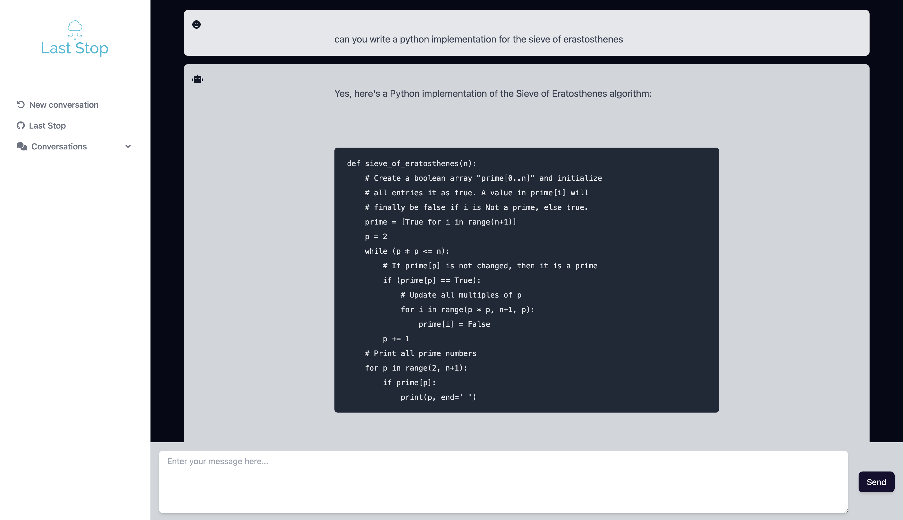

# Last Stop 

Welcome to the Last Stop for all of your LLM usage

## Last Stop benefits the individual and the organization

<br />

- __Cheaper usage of ChatGPT__ (individuals & organizations benefit!)
    - Why pay $20 a month when you can pay per service request, host it yourself!
- __Data Loss Prevention__ (DLP)
    - Organizations benefit from maintaining their own instance of ChatGPT on their servers
    - Allow your employees to access ChatGPT without bringing their own accounts
    - Monitor for potential DLP (emails, names, code, etc), sanitize the requests, block the requests, or anything in between
- __Build a company corpus__
    - A corpus is a collection of data, such as the prompts and the responses
    - Share prompts among the team so nobody has to search the same thing twice!
    - Provides better results and quicker results, as well as faster knowledge shares
- __Gain insights__ into common prompts and train your employees based on the commonalities
- __API Security__
    - ChatGPT has heightened security for their APIs that includes an "Opt-in" selection for your data to be shared. [Don't be the product, use the APIs!](https://help.openai.com/en/articles/7039943-data-usage-for-consumer-services-faq)!

 <br />

__The best benefit of all? This is intended to run entirely in your own network or on your own device!__

<br />

## Our mission

<br />

Last Stop's mission is to provide accessibility and security to the individual and to the organization. Second to that is providing a quality experience with all LLMs in one location - query one or query them all (as more APIs are released of course).

<br />



<br />

## Why we started this

<br />

Countries and organizations are banning ChatGPT altogether, but we believe that there is a happy medium. New innovation should not be stifled but encouraged safely, and that's exactly what we're here to do.

Don't be like these examples:

- [11% of data that employees paste in ChatGPT contains sensitive data](https://www.csoonline.com/article/3691115/sharing-sensitive-business-data-with-chatgpt-could-be-risky.html)
- [Samsung Proprietary Information Leak](https://mashable.com/article/samsung-chatgpt-leak-details)

<br />

Have more questions? Reach out to us in some of the following places:
- [Join our Discord](https://discord.gg/J8S4SYBqsq)
- [Circulate - Contact Us](https://www.circulate.dev/contact)
- [Kai Herrera](https://www.linkedin.com/in/kai-herrera/)
- [Dustin Buschman](https://www.linkedin.com/in/dbuschman/)

<br />

## How to deploy for the first time

1. In order to deploy for the first time you must have the following dependencies:
    - [An API Key for ChatGPT](https://platform.openai.com/overview) (yes, having this is better than employees signing in on their behalf)
        - If you want us to retrieve and manage the API Key on your behalf, let us know! 
    - Docker ([Rancher](https://rancherdesktop.io/) or [Docker Desktop](https://docs.docker.com/desktop/))
    - [aws-cli](https://aws.amazon.com/cli/)
    - [Golang 1.20](https://go.dev/doc/install)
    - [Node v18.x](https://nodejs.org/en)
    - [Terraform](https://developer.hashicorp.com/terraform/downloads?ajs_aid=bf5b0ec0-8e9f-4b0c-9e0b-1879f52fa26c&product_intent=terraform)
        - [tfenv](https://github.com/tfutils/tfenv) if you have MacOS / Linux is even better
    - [make](https://www.gnu.org/software/make/)

    Want to see an easier deployment process? Let us know! 

1. Once your machine is configured, take a look at the terraform.example.tfvars file.
    - VPC
        - If you already have one, input the IDs here
        - If you want a new one created, use the example settings
    - IP Addresses
        - We support IPv4 and IPv6, just add the proper IP ranges for your network.
        - If you need a different pattern, just let us know

1. Change the file name from `terraform.example.tfvars` to `terraform.tfvars`
    - This is ignored in .gitignore. If you want to check this into your PRIVATE repo, then comment out the `terraform.tfvars` line in .gitignore.

1. You are now ready to run the following:
    ```
    make init
    ```

    This will initialize a remote backend, and install everything using the Terraform workspace "default". This means that if you change workspace, you will also be able to change the environment that you are deploying. It's worth noting that if you expect to deploy across AWS accounts, the remote state will be different in each account unless you connect the accounts via IAM. Let us know if this is something you would like to see.

1. After your project has initialize, you __MUST__ store your API Key in the Secret that was created in Secrets Manager. Replace the entire string value with your API Key that you created on [OpenAI's Platform](https://platform.openai.com/overview).

1. You are now ready to use the website! Check out Cloudfront to get your website endpoint. If you would like to see some Route53 configuration, let us know! 

As you have read, we want you to let us know about anything you want or need. Please reach out for any reasons - you can find us above this section.

<br />

## Deploying new changes

Assuming you have initially deployed...

1. If you would like to see your changes before you apply, run the following:
    ```
    make plan
    ```

1. Any subsequent changes will now only require you to run the following:

    ```
    make apply
    ```

1. If you want to delete the project, run the following:
    ```
    make delete
    ```

<br />

## Current Status & Roadmap

We currently...
```
    - Support AWS only
    - Require building from source
    - Host in Cloudfront behind a WAF
```

We plan to... (these plans will be adjusted based on user interest!)
```
- Support more cloud providers
- Host ML in-network for DLP detection
- Provide an easier deployment process
- Much more - but the above are the big 3! 
```
